# Base de datos de SmartCampus UTP - Laboratorio Heltix

  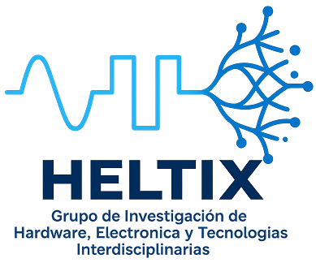

En este repositorio se guardan los datos de los distintos proyectos desarrollados por el laboratorio Heltix. Los equipos fueron desarrollados en la Universidad Tecnológica de Panamá y los datos que se muestran son aquellos recopilados en el campus Víctor Levi Sasso. En el repositorio hay diferentes carpetas, cada una dedicada a su sistema, dentro de los cuales destacamos los sistemas de monitoreo de variables ambientales, vibraciones en equipo electromecánico, estudio de ruido y consumo eléctrico / calidad de la energía.

## Dashboard Temperatura

  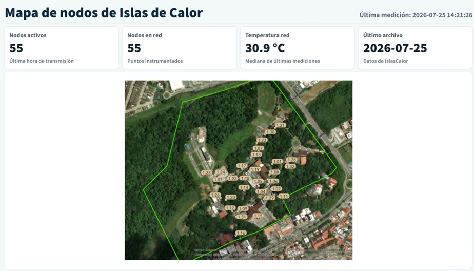
  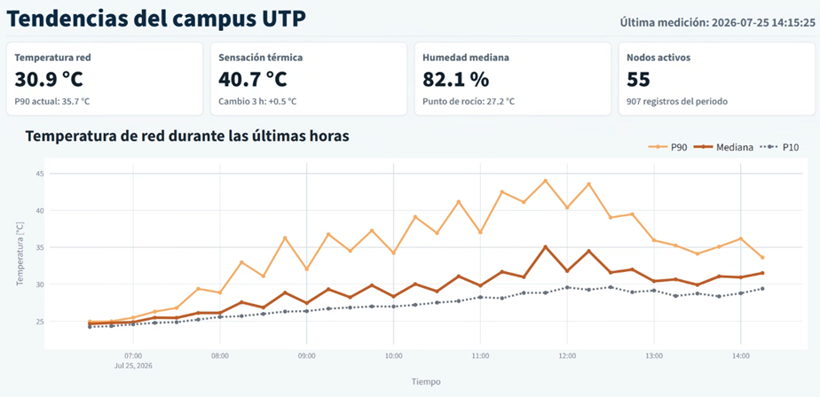

  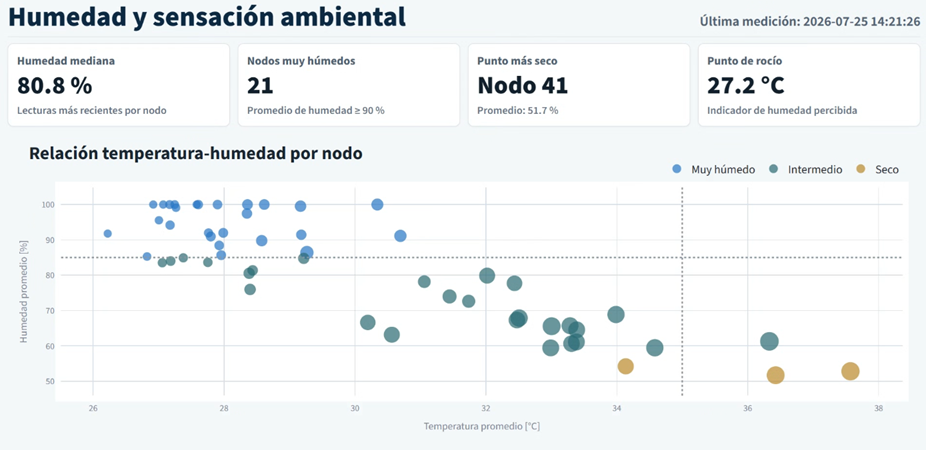
  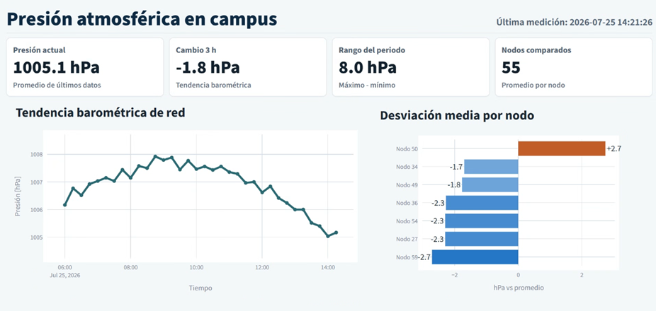

## Dashboard Ruido

  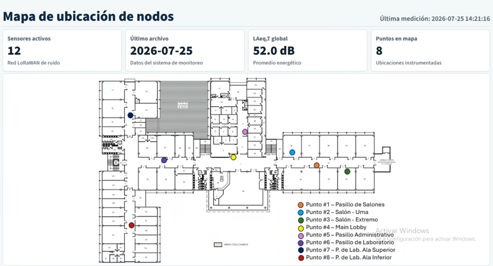
  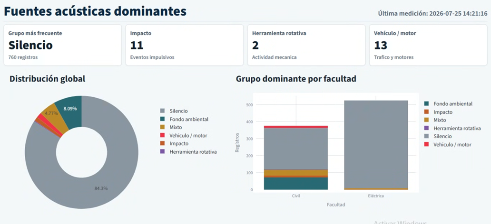

  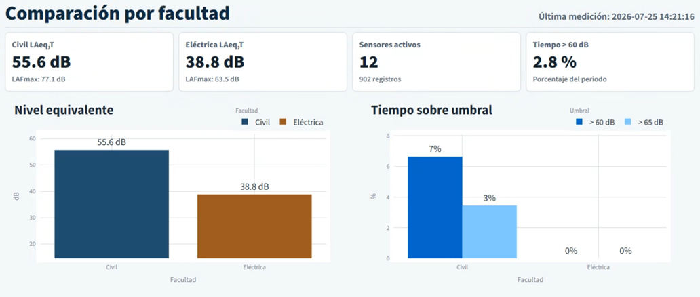
  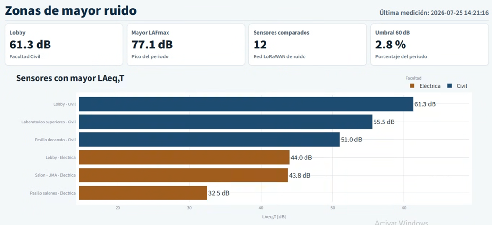

## Dashboard Calidad de Energía

  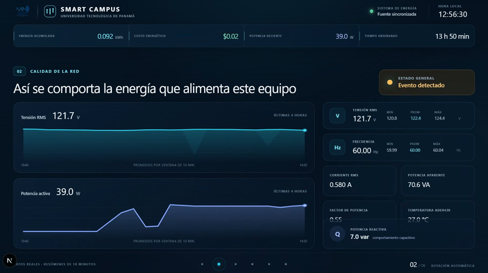

  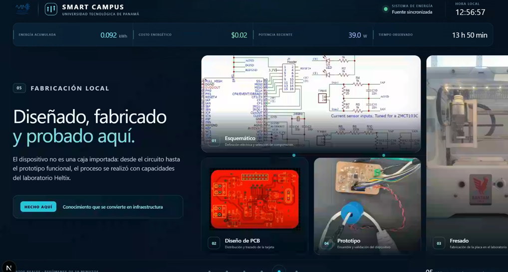

## Dashboard Vibraciones

  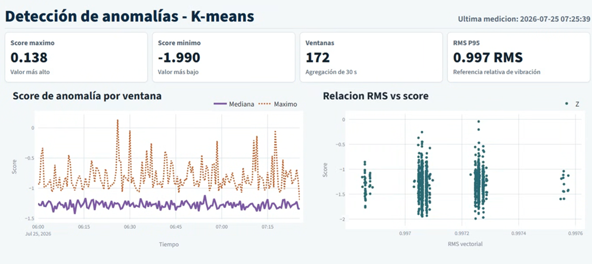
  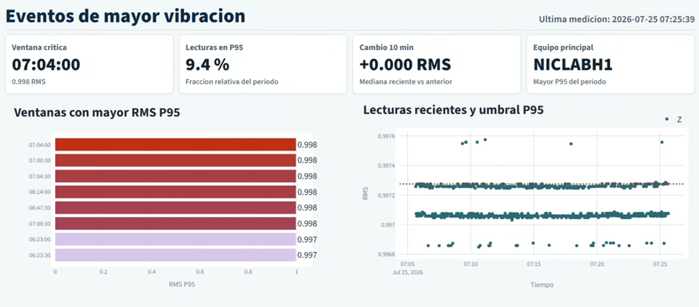

